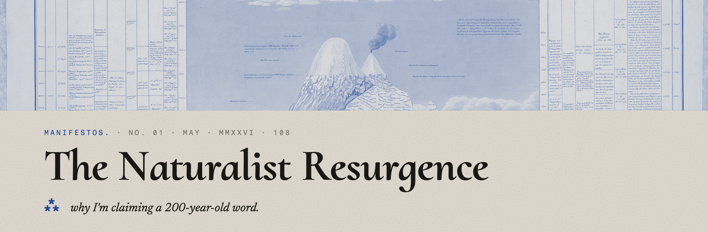
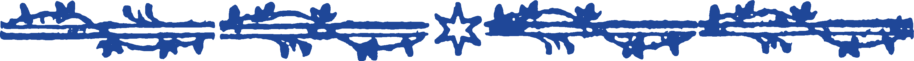
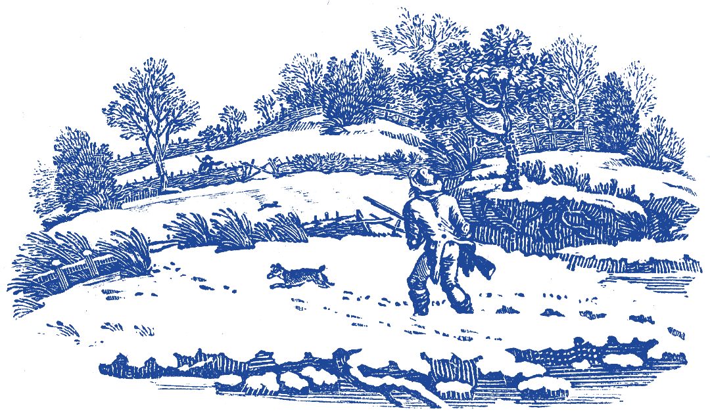

  

In 1799, a man who refused to be categorized sailed to South America with instruments, notebooks, and a question: how is everything connected?

He climbed volcanoes and measured their temperatures. He mapped rivers and counted their species. He pressed 60,000 plants and sketched the mountains they grew on. He wrote love letters to men in an era when that could get him killed. He invented ecology by refusing to separate the living from the land it lived on. He saw everything as one system because he refused to look at it any other way.

His name was Alexander von Humboldt. He was a naturalist. He was, by most accounts, the most famous scientist who ever lived. Then he died, and the universities took everything he unified and split it into pieces.

Biology. Geology. Botany. Zoology. Climatology. Anthropology. Archaeology. Astronomy. Each got a department. Each got a chair. Each got a journal. Each got a tenure track. Each built walls.

The naturalist had no department. So the naturalist had no funding. So the naturalist had no career path. So the naturalist died.

For 150 years, the only way to study the world was to pick a piece of it and stay in your lane. The departments rewarded depth. They punished breadth. *"What's your specialization?"* became the first question anyone asked. If you couldn't answer it, you didn't belong.

A generation of kids who wanted to explore everything were told to pick one thing. The ones who couldn't pick were told they lacked focus. The ones who refused to pick were told they weren't serious. The world was explored. The sky was mapped. The jobs were taken. Pick a lane or get out of the road.

That was the lie.

⁂

The world is not explored. 96% of Guatemala has never been scanned. 80% of the ocean floor is unmapped. A language dies every two weeks. Insect biomass is down 75% in monitored areas and most areas aren't monitored. Coral reefs are bleaching faster than they're documented. Glaciers are melting and exposing ancient artifacts that decompose within seasons because nobody is there to collect them. The sky is falling and planetary defense is staffed by one person.

The tools to fix all of this are cheap. A $200 eDNA test detects every organism in a tablespoon of dirt. A $50 AudioMoth records every sound in a forest for weeks. A $1,500 drone sees through jungle canopy. A $25 radio receiver maps the Milky Way from a backyard. A phone has better GPS than Humboldt's entire instrument kit. Free satellite data covers the entire planet and has been accumulating for over a decade with almost nobody analyzing it.

The tools don't know what department they belong to. A sample tube works for archaeology, biology, mycology, and pollution monitoring. A microphone records a dying language, a medicinal recipe, a bat call, and a whale song. A camera documents a cave painting, a troglobite, a coral reef, and a glacier retreating. The tools are interdisciplinary because the tools don't read org charts.

The departments are still split. The world never was.

⁂

The naturalist is back.

Not because anyone invited them. Not because the institutions made room. Because the tools got cheap enough that you don't need the institution anymore. A $2,800 kit in a duffel bag serves 15 projects across 10 disciplines. It weighs 9 kilograms. It fits under an airplane seat. Humboldt's kit required mules.

The new naturalist doesn't have a department. They have a question and a bus ticket. They don't have a tenure track. They have a cooler full of sample tubes and a friend who speaks the local language. They don't have a grant committee's approval. They have 150 potential patrons, a crowdfunding page, and a YouTube channel that funds the next trip with footage from the last one.

They are Merian selling paintings to fund her Suriname expedition. They are Humboldt climbing Chimborazo because nobody told him he couldn't. They are Darwin on the Beagle reading Humboldt's book and deciding to look at everything instead of one thing. They are the kid who wanted to dig in the dirt and look up at the sky and got told to stop dreaming.

The kid didn't stop. They just waited for the tools to catch up.

  

This is not a movement. It's a resurgence. The naturalist existed for 2,400 years, from Aristotle walking the Lyceum to Darwin cataloguing barnacles. It was the longest-running intellectual tradition in human history. The departmental era that killed it lasted 150 years. A blip.

The pattern across civilizations: a unifier emerges who sees everything as connected. Institutions split the knowledge into pieces. The pieces get stuck. A new unifier emerges with new tools. It happened in Athens. It happened in Baghdad. It happened in Renaissance Florence. It happened in Enlightenment Berlin. It's happening now, in a van with a Starlink dish, on a graveyard shift, in a conversation about caves.

The van was never a death rattle. It was an escape pod.

⁂

Here is what we believe.

**Curiosity is a sufficient qualification.** The dirt doesn't check your credentials.

**Wonder is a valid methodology.** If the feeling of awe drives you somewhere, the science follows. Humboldt knew this. He called it Romantic philosophy. We call it Tuesday.

**Everything is connected.** A cave in Guatemala contains archaeology, biology, linguistics, ethnobotany, mycology, and the deepest questions about human origins, all in the same dirt. The departments separated these into different careers. The dirt didn't get the memo.

**The gap between what's possible and what's being done is the opportunity.** In every field. In every country. The institutions are slow because the incentives reward slowness. The tools are fast because the tools don't have incentives. The naturalist uses the fast tools to fill the gap the slow institutions left.

**Open data is unkillable.** The Ming burned Zheng He's fleet. You can't burn a dataset on a thousand servers. Publish everything. Open-source everything. Let anyone build on it. The knowledge belongs to the species, not the department.

**Cheap is a feature.** $200 eDNA tests. $50 acoustic monitors. $1,500 drones. $25 radio telescopes. The cost collapse isn't a limitation. It's a liberation. The cheaper the tool, the more people can use it. The more people use it, the more data exists. The more data exists, the less any single gatekeeper can control the narrative.

The patron gets immortality. The community gets their heritage documented. The naturalist gets to live. Everyone wins except the committee that said it couldn't be done.

⁂

Fifteen projects. Sixty ideas. One duffel bag. One question: *what's out there that nobody looked at?*

The answer is almost everything.

The world is not explored. The sky is not being watched. The ocean floor is not mapped. The languages are not recorded. The insects are not counted. The reefs are not documented. The glaciers are exposing things nobody collects. The caves have never been tested. The data is sitting on servers that nobody searches. The elders are dying with libraries in their heads.

Below and above. That's where everything is. The surface is where the institutions live, telling you to stay in your lane.

The naturalist doesn't have a lane. The naturalist has a direction. Down into the caves. Up into the sky. Out into the ocean. Along the rivers. Through the forest. Into the city. Across the glacier. Under the water. Wherever the question leads.

Better tools. Same refusal to be categorized.

⁂

We separated play from ritual from music from worship from science. We gave each one a department. The cave didn't know the difference. The people in it probably didn't either.

A group of humans sitting in a resonant chamber, making sounds, discovering which ones the cave gives back, doing it again tomorrow because it felt good. Is that play? Music? Worship? Science? It's all of them at once. We carved those into categories later. The experience was unified from the start.

The naturalist refuses to separate disciplines because nature never separated them. A cave is simultaneously a geological formation, a biological habitat, an acoustic space, a human shelter, a sacred site, a DNA repository, a language classroom, and a piece of the sky seen from below. The departments say pick one. The naturalist says they're the same place.

This isn't a return to some idealized past. It's a recognition that the departmental model was the aberration. The unified approach is the default. It's what humans did for 300,000 years before someone built a university and started drawing lines.

Humboldt knew this. The temperature of the volcano AND the awe of standing on it. Both were data. Both went in the notebook. The departments said pick the temperature or the awe. You can't publish both in the same journal.

The cave didn't know the difference.

⁂

Go.

  

kearney108 · manifestos · 01 · MAY · 2026 · 108
